# 上下文压缩模块完整详尽流程图

---

## 1. 模块边界

严格按代码职责划分，上下文压缩相关能力由下面几部分共同组成：

- `ContextManager.prepare_turn()`
- `HistoryCompactor.apply_lightcompact()`
- `HistoryCompactor.compact_if_needed()`
- `HistoryCompactor._compact_history()`
- `HistoryCompactor._merge_summary()`
- `HistoryCompactor._enforce_hard_limit()`
- `Runtime._fit_request_messages_to_budget()`
- `Runtime._budget_tool_result_message()`
- `WorkspaceStore.write_transcript()`
- `WorkspaceStore.write_text_artifact()`

也就是说，它不是“只有 full compaction 才算压缩”，而是一个**分层压缩系统**：

1. 轻压缩历史大消息  
2. 摘要压缩中段历史  
3. 工具结果超长外置  
4. 请求发送前再次按预算裁剪

---

## 2. 总览流程图

```mermaid
flowchart TD
    subgraph Prep [前置准备阶段]
    A[进入新一轮 agent step] --> B[ContextManager.prepare_turn]
    B --> C["构建前置 prompt tokens (system + user)"]
    end

    subgraph LightCompact [轻量压缩阶段 - Light Compact]
    C --> D[HistoryCompactor.apply_lightcompact]
    D --> E{total_tokens >= lightcompact_threshold?}
    E -- 否 --> F[跳过 lightcompact]
    E -- 是 --> G[_lightcompact_history]
    G --> G1[筛选 lightcompact 候选消息]
    G1 --> G2["把长正文写入 artifacts/*.md"]
    G2 --> G3[插入 internal_artifact_ref]
    G3 --> G4[原消息替换为轻摘要 replacement]
    G4 --> H["更新 snapshot: last_effective_tokens / reason=lightcompact"]
    end

    subgraph FullCompact [深度压缩阶段 - Full Compact]
    F --> I[ContextManager.needs_compaction]
    H --> I
    I --> J{current_tokens >= compact_threshold?}
    J -- 否 --> K[prepare_turn 结束]
    J -- 是 --> L[HistoryCompactor.compact_if_needed]
    L --> M{below threshold?}
    M -- 是 --> K
    M -- 否 --> N{consecutive_failures >= MAX?}
    N -- 是 --> O["熔断 circuit_open (跳过 full compaction)"]
    O --> K
    N -- 否 --> P[_compact_history]
    P --> P1[去掉旧 memory_summary 和 internal messages]
    P1 --> P2[_group_history 按逻辑分组]
    P2 --> P3[_split_groups 切成 early/middle/recent]
    P3 --> P4[_resolve_delta_start 确定 middle 增量起点]
    P4 --> P5[delta_messages = flatten]
    P5 --> Q{delta_messages 是否为空?}
    Q -- 否 --> R["write_transcript 到 transcripts/*.md"]
    R --> S[_merge_summary]
    S --> T["写回 snapshot.summary + paths + anchor"]
    Q -- 是 --> T
    T --> U[重建 history]
    U --> U1[可选 internal_compaction_event]
    U --> U2[build memory_summary]
    U --> U3[保留 early groups]
    U --> U4[保留 recent groups]
    U --> U5[dedupe]
    U5 --> V[_enforce_hard_limit]
    V --> W{still > effective_context_window?}
    W -- 否 --> X[保存 rebuilt history / snapshot]
    W -- 是 --> Y[紧急尾部保留裁剪]
    Y --> X
    X --> K
    end

    subgraph Runtime [运行时预算管控 - Runtime Budgeting]
    K --> Z[build_messages]
    Z --> AA[Runtime._fit_request_messages_to_budget]
    AA --> AB{request tokens <= budget?}
    AB -- 是 --> AC[直接发给模型]
    AB -- 否 --> AD[先删中间消息]
    AD --> AE{仍超预算?}
    AE -- 否 --> AC
    AE -- 是 --> AF[裁剪单条长消息 head/tail]
    AF --> AC
    AC --> AG{模型是否返回超长 tool result?}
    AG -- 否 --> AH[常规继续]
    AG -- 是 --> AI[Runtime._budget_tool_result_message]
    AI --> AJ["写入 artifacts/*.md"]
    AJ --> AK[保留 chunk/range progress head]
    AK --> AL[插入 internal_artifact_ref]
    AL --> AM[tool result 替换为 budgeted replacement]
    AM --> AH
    end
```

---

## 3. 入口层：`prepare_turn()` 详细流程

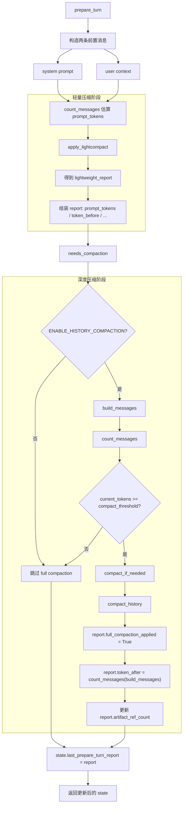

---

## 4. Lightcompact 详细流程

```mermaid
flowchart TD
    A[apply_lightcompact] --> B[读取 history]
    B --> C["_visible_history (过滤 internal 事件/引用)"]
    C --> D[token_before = prompt_tokens + visible_history_tokens]
    D --> E{history 为空?}
    E -- 是 --> F[直接返回 state, report]
    E -- 否 --> G[load snapshot]
    G --> H{token_before >= lightcompact_threshold?}
    H -- 否 --> I[跳过处理]
    H -- 是 --> J[_lightcompact_history]

    subgraph CandidateFilter [候选消息筛选]
    J --> K[_lightcompact_candidate_indexes]
    K --> K1[跳过 KEEP_FIRST_MESSAGES]
    K1 --> K2[跳过 KEEP_LAST_MESSAGES]
    K2 --> K3[跳过 KEEP_LAST_USER_MESSAGES]
    K3 --> K4[跳过 memory_summary / internal messages]
    end

    K4 --> L[逐条遍历 candidate]
    
    subgraph ProcessMessage [单条消息处理逻辑]
    L --> M{_can_lightcompact_message?}
    M -- 否 --> N[保留原消息]
    M -- 是 --> O{kind 为 assistant_text/tool_result 且未处理?}
    O -- 否 --> N
    O -- 是 --> P{content_len > min_source_chars?}
    P -- 否 --> N
    P -- 是 --> Q[write_text_artifact]
    Q --> R[_summarize_lightcompact_content]
    R --> R1[归一化 / 去重 / 去噪]
    R1 --> R2[按关键词优先排序]
    R2 --> R3[截取前 N 行]
    R3 --> S[_build_lightcompact_replacement]
    S --> T[插入 internal_artifact_ref]
    T --> U["替换原消息 (更新 _source_name, _lightcompact_applied)"]
    U --> V[changed = True]
    end

    N --> W{还有候选?}
    V --> W
    W -- 是 --> L
    W -- 否 --> X[返回 rebuilt_history, changed]

    X --> Y{changed?}
    Y -- 否 --> I
    Y -- 是 --> Z[更新 snapshot.last_effective_tokens]
    Z --> ZA[snapshot.last_compaction_reason = lightcompact]
    ZA --> ZB[snapshot.updated_at = now_ts]
    ZB --> ZC[state.history = rebuilt_history]
    ZC --> ZD[save_snapshot]
    ZD --> ZE[更新 report.token_after / artifact_ref_count]
    
    I --> ZE
    ZE --> ZF[返回结果]
```

### 4.1 Lightcompact replacement 结构

压缩后保留在 history 里的替代文本结构是：

```text
[lightly compacted older <label>; full original moved out of inline history]
Summary:
- ...
- ...

Original size: <chars> chars across <lines> lines
Full original saved as transcript artifact: <artifact_label>
Use read_transcript with that path if exact details are needed.
```

也就是说，lightcompact 的本质是：

- **原文外置**
- **history 内保留短摘要**
- **保留可恢复入口**

---

## 5. Full Compaction 详细流程

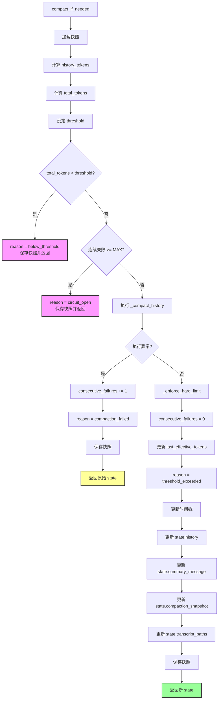

---

## 6. `_compact_history()` 详细流程

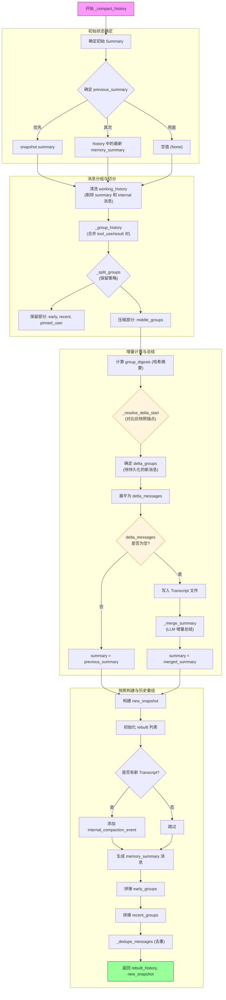

### 6.1 分组策略含义

`_group_history()` 的关键点是：

- `assistant_tool_use`
- 后续连续的 `user_tool_result`

会被合并为一个逻辑组。

这样 full compaction 时压缩的是“一个工具行动单元”，而不是把 tool_call 和 tool_result 拆散。

### 6.2 切分策略含义

`_split_groups()` 不是简单按位置切历史，而是构造三类保留区：

- **early groups**：开头锚点  
- **recent groups**：结尾工作集  
- **pinned user groups**：最近用户显式约束

真正允许被压缩成 transcript + summary 的，是中间的 `middle_groups`。

---

## 7. Summary Merge 详细流程

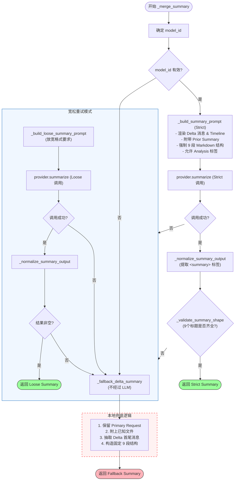

### 7.1 严格总结 prompt 的目标

strict prompt 要求 summary 使用固定九段结构：

1. Primary Request and Intent  
2. Key Technical Concepts  
3. Files and Code Sections  
4. Errors and Fixes  
5. Problem Solving  
6. All User Messages  
7. Pending Tasks  
8. Current Work  
9. Optional Next Step

---

## 8. `memory_summary` 构建流程

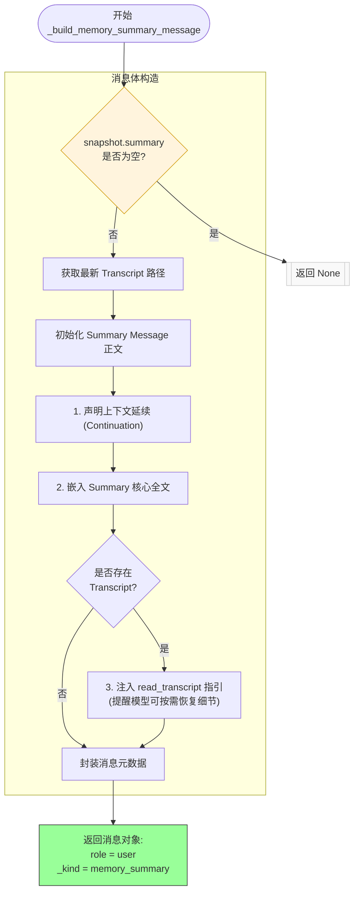

生成后的 `memory_summary` 会作为**模型可见消息**保留在 history 中。  
而 `internal_compaction_event` 不可见，只作为内部账本。

---

## 9. Hard Limit 紧急裁剪流程

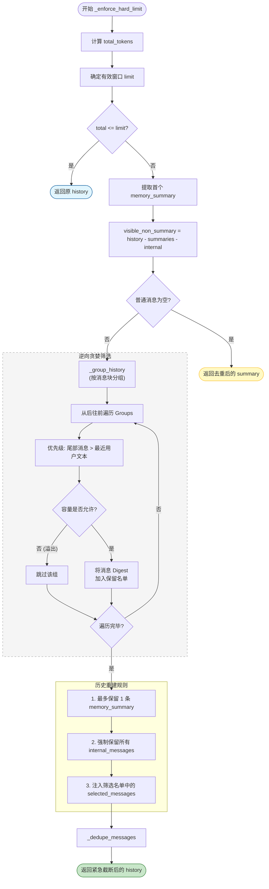

### 9.1 Hard Limit 的作用

这不是正常压缩路径，而是**最后保险丝**。  
如果 full compaction 后仍然超窗口，就不再尝试摘要，而是：

- 保一个 `memory_summary`
- 保极少量尾部工作集
- 保近期用户消息
- 其余丢弃

---

## 10. 请求发送前的最后一层预算裁剪

`HistoryCompactor` 处理的是 **history 级别压缩**。  
但真正发给模型前，`Runtime._fit_request_messages_to_budget()` 还会对**单次请求消息集**再做一次预算控制。

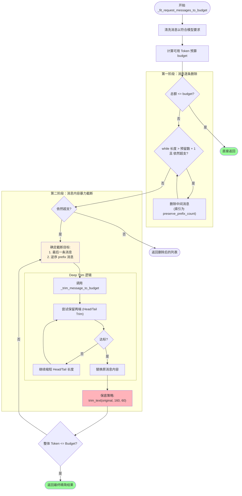

### 10.1 这层与 full compaction 的区别

- `full compaction`：改变 session history 的长期结构  
- `request budget fit`：只保证**这一次请求**能塞进窗口

它不会写 transcript，也不会写 summary，只是即时裁剪。

---

## 11. 超长工具结果的并行压缩路径

上下文压缩不仅发生在 `prepare_turn` 之前。  
运行中如果工具返回的内容过大，还会进入一条单独的“工具结果预算化”路径。

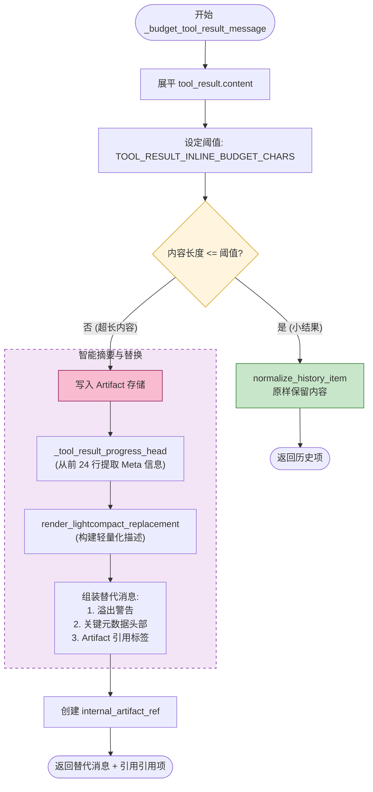

### 11.1 为什么这条路径重要

它解决的问题是：

- 工具本轮读取的内容可能非常大
- 这部分内容还没来得及进入下一轮压缩
- 如果直接把完整 tool result 放进 history，会把下一轮 prompt 顶爆

因此 runtime 会先做一次**工具结果级别的内联预算控制**。

---

## 12. 工作区持久化与恢复点

压缩模块依赖 `WorkspaceStore` 提供两个关键持久化点：

### 12.1 Transcript

- 由 `write_transcript(chat_id, delta_messages)` 写入
- 用于 full compaction 后恢复被移出的中段历史

### 12.2 Artifact

- 由 `write_text_artifact(chat_id, prefix, text)` 写入
- 用于 lightcompact 和 oversized tool result 的原文保存

它们在下一轮不会自动回灌到 prompt，而是通过：

- `read_transcript`
- `read_prompt_history`

等工具按需恢复。

---

## 13. 全链路关系图（最完整版本）

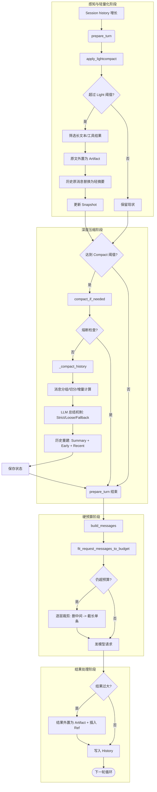


