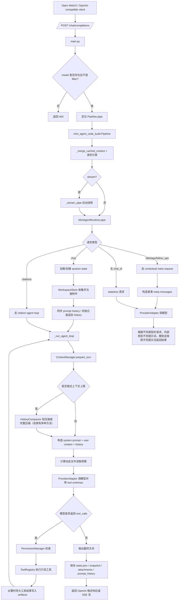

```mermaid
flowchart TD
    A[Open WebUI / OpenAI-compatible client] --> B[/POST /chat/completions/]
    B --> C[main.py]
    C --> D{model 是否存在且不是 filter?}
    D -- 否 --> E[返回 404]
    D -- 是 --> F[定位 Pipeline.pipe]
    F --> G[mini_agent_code_build.Pipeline]
    G --> H[_merge_cached_context + 请求分类]
    H --> I{stream?}
    I -- 是 --> J[_stream_pipe 后台线程]
    I -- 否 --> K[MiniAgentRuntime.pipe]
    J --> K

    K --> L{请求类型}
    L -- chat --> M[加载/创建 session state]
    L -- title/tags/follow_ups --> N[走 contextual meta request]
    L -- citations --> O[走 citation agent loop]
    L -- 无 chat_id --> P[stateless 请求]

    M --> Q[WorkspaceStore 收集并注册附件]
    Q --> R[同步 prompt history / 初始化或追加 history]
    R --> S[_run_agent_loop]
    O --> S
    N --> T[构造紧凑 meta messages]
    T --> U[ProviderAdapter 调模型]
    P --> U
    U --> BA[根据不同类型的请求，内部规划不同提示词，模型会按照不同提示词返回结果]

    S --> V[ContextManager.prepare_turn]
    V --> W{是否接近上下文上限}
    W -- 是 --> X[HistoryCompactor 轻压缩或完整压缩（该类有多种方法）]
    W -- 否 --> Y[构造 system prompt + user context + history]
    X --> Y
    Y --> Z[计算动态文件读取预算]
    Z --> AA[ProviderAdapter 调模型并带 tool schemas]
    AA --> AB{模型是否返回 tool_calls}
    AB -- 是 --> AC[PermissionManager 检查]
    AC --> AD[ToolRegistry 执行只读工具]
    AD --> AE[必要时将大工具结果写入 artifacts]
    AE --> S
    AB -- 否 --> AF[输出最终文本]

    AF --> AG[保存 state.json / snapshot / attachments / prompt_history]
    AG --> AH[返回 OpenAI 格式响应或 SSE 流]
```
